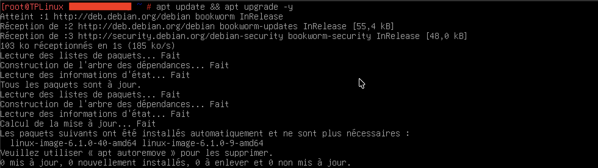
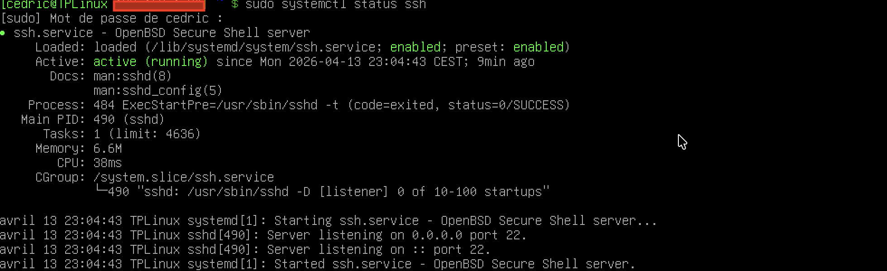
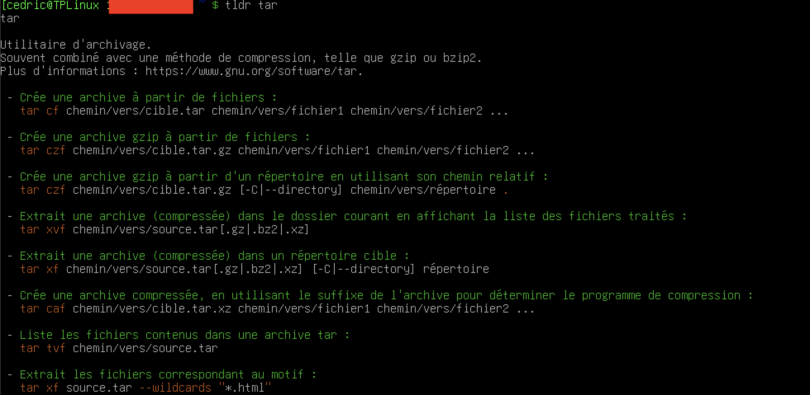

# Configuration de base Debian Trixie 13 — Procédure

---

## A. Mise à jour du système

```bash
# Passer en root
su -

# Vérifier la version Debian
cat /etc/debian_version

# Mise à jour complète
apt update && apt full-upgrade -y
```



---

## B. Installation de sudo

```bash
# Installation de sudo
apt install sudo -y

# Ajout de l'utilisateur au groupe sudo
usermod -aG sudo $USER

# Vérification
groups $USER
```


> Se déconnecter et se reconnecter pour que le changement de groupe soit pris en compte.

---

## C. Installation et configuration OpenSSH

```bash
# Installation OpenSSH
apt install openssh-server -y

# Vérification du service
systemctl status ssh
# doit renvoyer : enabled et running

# Récupérer l'adresse IP du serveur
ip a
```



### Génération de la clé SSH sur le poste client

```bash
# Sur le poste client (Linux / macOS / Windows OpenSSH)
ssh-keygen -t ed25519 -C "admin@creativefusion-studios.eu"
```

Génère deux fichiers :
- Clé privée : `~/.ssh/id_ed25519` — à importer dans Royal TSX / Xpipe
- Clé publique : `~/.ssh/id_ed25519.pub` — à installer sur le serveur

### Installation de la clé publique sur le serveur

```bash
# Méthode simple depuis le poste client
ssh-copy-id -i ~/.ssh/id_ed25519.pub utilisateur@IP_SERVEUR

# Méthode manuelle sur le serveur
mkdir -p ~/.ssh
chmod 700 ~/.ssh
cat id_ed25519.pub >> ~/.ssh/authorized_keys
chmod 600 ~/.ssh/authorized_keys
```

### Import dans Royal TSX

1. Ouvrir Royal TSX
2. Sélectionner ou créer la connexion SSH
3. `Credentials → Private Key → Browse`
4. Sélectionner `id_ed25519`
5. Renseigner la passphrase si elle a été définie

### Désactivation de l'authentification par mot de passe

```bash
nano /etc/ssh/sshd_config
```

```ini
PubkeyAuthentication yes
PasswordAuthentication no
PermitRootLogin no
```

```bash
systemctl restart ssh
```

---

## D. Installation de tldr

`tldr` affiche des exemples pratiques et concis pour les commandes Linux — une alternative lisible à `man`.

### Installation via pipx

```bash
# Installation de pipx
sudo apt update
sudo apt install pipx -y

# S'assurer que les binaires pipx sont dans le PATH
pipx ensurepath
```

```bash
# Installation de tldr
pipx install tldr

# Mise à jour de la base de données des pages
tldr --update
```

### Vérification

```bash
# Tester avec la commande ls
tldr tar
```



### Résolution — commande introuvable

Si `tldr` renvoie `command not found` après installation :

```bash
# Vérifier que ~/.local/bin est dans le PATH
echo $PATH

# Si absent — ajouter à ~/.bashrc
echo 'export PATH="$HOME/.local/bin:$PATH"' >> ~/.bashrc

# Recharger le shell
source ~/.bashrc
```

### Exemples d'utilisation

```bash
tldr tar        # syntaxe d'archivage
tldr rsync      # exemples de synchronisation
tldr systemctl  # gestion des services
tldr find       # recherche de fichiers
tldr curl       # requêtes HTTP
```

---

## E. Récapitulatif des services installés

```bash
# Vérification finale
systemctl status ssh
groups $USER
tldr --version
```

| Service | Statut attendu |
|---|---|
| OpenSSH | `enabled` · `running` |
| sudo | Utilisateur dans le groupe `sudo` |
| tldr | Version affichée · `tldr tar` fonctionnel |

---

> Configuration testée sur Debian Trixie 13.x — VirtualBox / VMware Fusion  
> Dernière mise à jour : avril 2026
