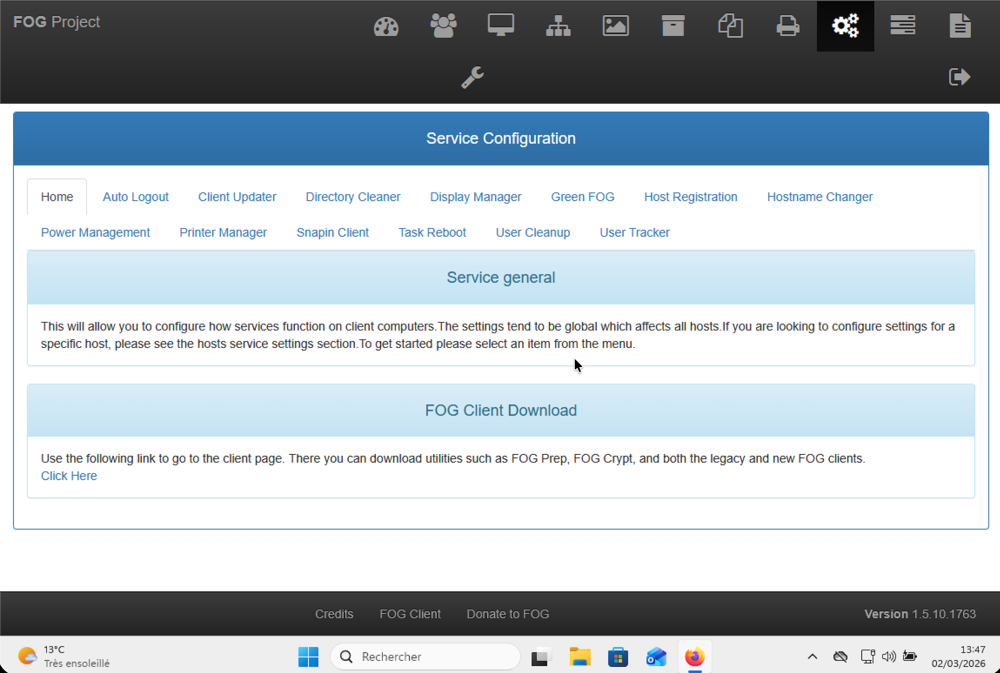
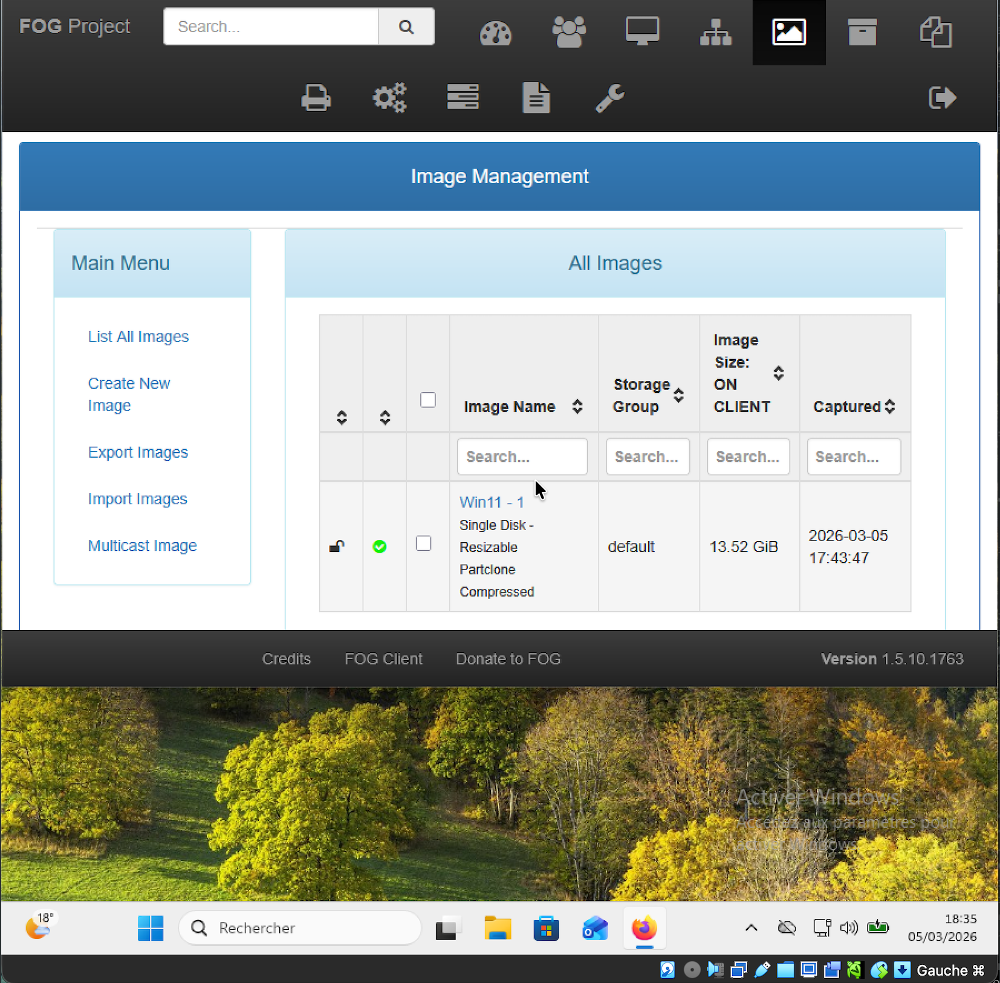
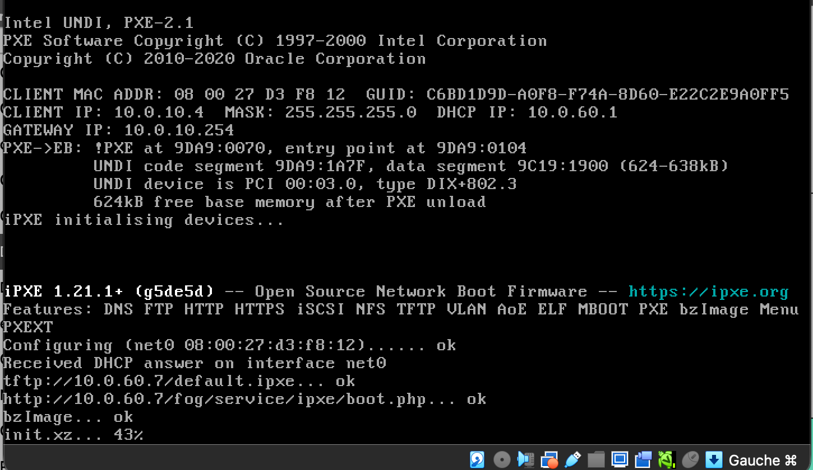
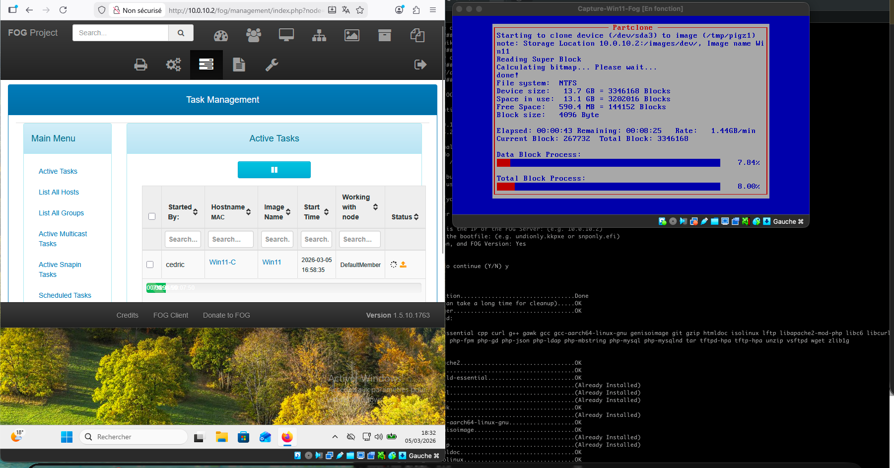
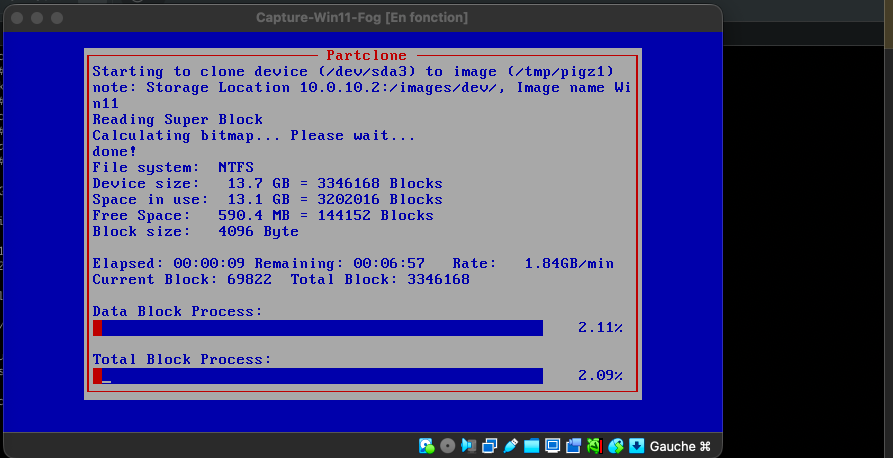
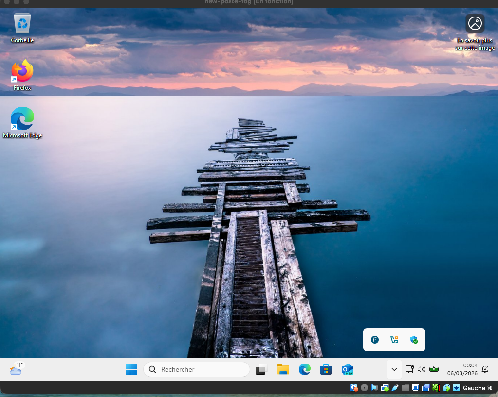

# FOGProject — Procédure d'installation

---

## A. Déploiement de pfSense

1. Créer une VM pfSense avec deux interfaces :
   - `WAN` — NAT ou Bridge de l'hyperviseur
   - `LAN` — Réseau interne `10.0.80.0/24`
2. Installer pfSense
3. Activer le serveur DHCP sur le LAN interne
4. Vérifier les attributions IP et les options PXE — FOG gère le PXE via `ipxe.pxe`


---

## B. Installation du serveur Debian (FOG)

```bash
# IP fixe obligatoire — à configurer avant installation FOG
# Mise à jour du système
sudo apt update && sudo apt upgrade -y
```

---

## C. Installation de FOG Project

```bash
# Cloner le dépôt officiel
git clone https://github.com/FOGProject/fogproject.git

# Lancer le script d'installation
cd fogproject/bin
sudo ./installfog.sh
```

Choix lors de l'installation :
- Type : **Installation Standard**
- Interface réseau : sélectionner la bonne interface (ex. `ens33`)
- Questions DHCP : répondre **NON** à chaque question — pfSense gère le DHCP


---

## D. Déploiement de la base de données

Depuis le navigateur sur la machine Debian bureau :

```
http://<IP_FOG>/fog/management
```

Valider la création automatique de la base de données via l'assistant web.


---

## E. Première connexion et téléchargement de l'agent

1. Se connecter à l'interface FOG Web UI
2. Aller dans `FOG Client` → télécharger `SmartInstaller`
3. Placer le fichier dans un dossier partagé accessible aux VMs Windows



---

## F. Création de l'image dans FOG

Dans l'interface FOG : `Images → Create New Image`

| Paramètre | Valeur |
|---|---|
| Nom | `PosteCreativeFusion` |
| OS | Windows Other (4) |
| Image Type | Single Disk - Resizable |
| Image Manager | Partclone Gzip |
| Image Path | `images/PosteCreativeFusion` |



---

## G. Préparation du système modèle Windows 11

### Installation du système

- Pas de clé produit
- Édition : Windows 11 Pro
- Partitionnement : supprimer toutes les partitions — laisser Windows recréer automatiquement

### Passage en mode Audit

À l'écran de configuration régionale — **ne pas cliquer** :

```
Ctrl + Shift + F3
```

Windows redémarre en mode Audit.

### Configuration en mode Audit

- Fermer systématiquement la fenêtre Sysprep — ne jamais l'utiliser directement
- Installer les applications souhaitées : `7-Zip`, `Firefox`, `FOG Client`

### Installation du FOG Client

1. Ouvrir le dossier partagé contenant `SmartInstaller`
2. Exécuter en administrateur
3. Renseigner l'adresse IP du serveur FOG
4. Désactiver FOG Tray

### Sysprep

```
Generalize → Shutdown → OOBE
```

---

## H. Enregistrement de la machine dans FOG

1. Modifier l'ordre de boot — **PXE en premier**
2. Booter la VM en PXE
3. Choisir : **Perform Full Host Registration and Inventory**
4. Renseigner le nom de la machine et l'ID de l'image à associer



---

## I. Capture de l'image

### Côté FOG Web

```
Hosts → List All Hosts → sélectionner la machine → Capture
```

### Côté machine Windows

1. Booter en PXE
2. La capture démarre automatiquement via Partclone

```
Starting to clone device (/dev/sda1) to image (/tmp/pigz1)
Storage Location: 10.0.80.1:/images/
File system: NTFS
```



---

## J. Déploiement sur une nouvelle machine

### Création de la VM cible

1. Créer une VM vide aux mêmes caractéristiques que le modèle
2. Booter en PXE
3. Enregistrer via : **Perform Full Host Registration and Inventory**

### Affectation de l'image

```
FOG Web → Hosts → associer l'image capturée à la nouvelle machine
```

### Lancement du déploiement

```
Tasks → Deploy
```

Booter la machine en PXE — le déploiement s'exécute automatiquement.



---

## K. Vérifications post-déploiement

- Windows 11 démarre correctement
- Applications correctement déployées
- FOG Client opérationnel



---

## Sources

- [FOGProject — Documentation officielle](https://docs.fogproject.org/en/latest/installation/server/install-fog-server/)
- [GitHub FOGProject](https://github.com/FOGProject/fogproject)

---

> Testé dans un environnement VirtualBox isolé — 5 VMs interconnectées  
> Dernière mise à jour : avril 2026
