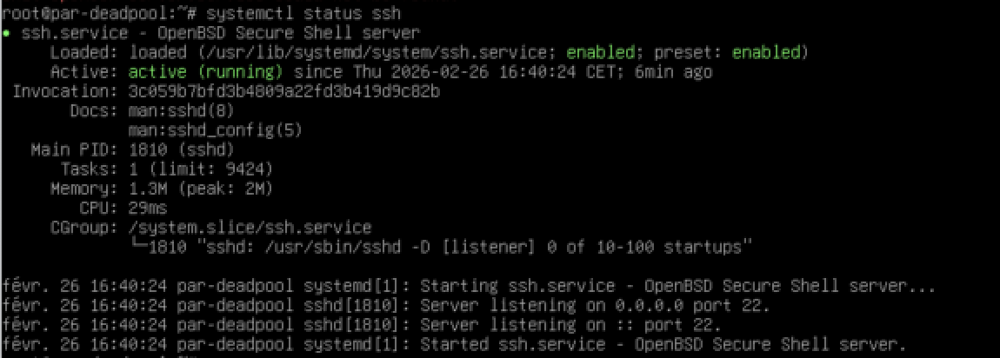

# Zabbix 7.4 — Procédure d'installation

---

## A. Prérequis — configuration de base Debian

```bash
# Mise à jour complète du système
apt update && apt full-upgrade -y

# Installation des paquets utilitaires
apt install -y sudo openssh-server curl wget gnupg lsb-release

# Ajout de l'utilisateur au groupe sudo
usermod -aG sudo $USER
groups $USER
```

### Vérification SSH

```bash
systemctl status ssh
# doit renvoyer : enabled et running

ip a
# noter l'adresse IP pour la connexion SSH
```



---

## B. Sécurisation SSH par clé ed25519

### Génération de la clé sur le poste client

```bash
# Sur le poste client (Linux / macOS / Windows OpenSSH)
ssh-keygen -t ed25519 -C "admin@creativefusion-studios.eu"
```

Génère deux fichiers :
- Clé privée : `~/.ssh/id_ed25519` — à importer dans Royal TSX / Xpipe
- Clé publique : `~/.ssh/id_ed25519.pub` — à installer sur le serveur

### Installation de la clé sur le serveur

```bash
# Méthode simple
ssh-copy-id -i ~/.ssh/id_ed25519.pub utilisateur@IP_SERVEUR

# Méthode manuelle
mkdir -p ~/.ssh
chmod 700 ~/.ssh
cat id_ed25519.pub >> ~/.ssh/authorized_keys
chmod 600 ~/.ssh/authorized_keys
```

### Désactivation de l'authentification par mot de passe

```bash
nano /etc/ssh/sshd_config
```

```ini
PubkeyAuthentication yes
PasswordAuthentication no
PermitRootLogin no
```

```bash
systemctl restart ssh
```

---

## C. Installation de PostgreSQL

```bash
apt install -y postgresql postgresql-contrib
systemctl enable --now postgresql

# Création de l'utilisateur et de la base Zabbix
sudo -u postgres createuser --pwprompt zabbix
sudo -u postgres createdb -O zabbix zabbix
```

---

## D. Installation de Nginx + PHP

```bash
apt install -y nginx php-fpm php-pgsql php-gd php-xml php-bcmath \
    php-ldap php-mbstring php-json php-zip
systemctl enable --now nginx
```

---

## E. Ajout du dépôt Zabbix et installation

```bash
# Téléchargement et ajout du dépôt Zabbix 7.x
wget https://repo.zabbix.com/zabbix/7.0/debian/pool/main/z/zabbix-release/zabbix-release_7.0-1+debian13_all.deb
dpkg -i zabbix-release_7.0-1+debian13_all.deb
apt update

# Installation des composants Zabbix
apt install -y zabbix-server-pgsql zabbix-frontend-php \
    zabbix-nginx-conf zabbix-sql-scripts zabbix-agent
```

---

## F. Installation et activation de TimescaleDB

```bash
# Ajout du dépôt TimescaleDB
wget -qO- https://tsdb.co/install.sh | bash
apt install -y timescaledb-2-postgresql-17

# Configuration PostgreSQL
timescaledb-tune --quiet --yes
systemctl restart postgresql

# Activation de l'extension sur la base Zabbix
sudo -u postgres psql -d zabbix -c "CREATE EXTENSION IF NOT EXISTS timescaledb;"
```

---

## G. Import du schéma Zabbix

```bash
zcat /usr/share/zabbix-sql-scripts/postgresql/server.sql.gz | \
    sudo -u zabbix psql zabbix
```

---

## H. Configuration du serveur Zabbix

```bash
nano /etc/zabbix/zabbix_server.conf
```

```ini
DBHost=localhost
DBName=zabbix
DBUser=zabbix
DBPassword=<mot_de_passe>
```

```bash
systemctl enable --now zabbix-server
```

---

## I. Configuration du frontend Nginx

```bash
nano /etc/zabbix/nginx.conf
```

```nginx
server {
    listen 80;
    server_name zabbix.local;
    root /usr/share/zabbix;
    index index.php;

    location ~ \.php$ {
        fastcgi_pass unix:/run/php/php-fpm.sock;
        fastcgi_index index.php;
        include fastcgi.conf;
    }
}
```

```bash
ln -s /etc/zabbix/nginx.conf /etc/nginx/conf.d/
systemctl restart nginx php-fpm
```

---

## J. Vérification des services

```bash
systemctl status nginx
systemctl status php-fpm
systemctl status postgresql
systemctl status zabbix-server
systemctl status zabbix-agent
```


---

## K. Accès au dashboard

```
http://IP_SERVEUR/zabbix
```

Suivre l'assistant web :
- Connexion à PostgreSQL — renseigner les identifiants
- Fuseau horaire : `Europe/Paris`
- Changer le mot de passe admin par défaut


---

## L. Déploiement des agents

```bash
# Sur chaque équipement à superviser
apt install -y zabbix-agent

nano /etc/zabbix/zabbix_agentd.conf
```

```ini
Server=<IP_SERVEUR_ZABBIX>
ServerActive=<IP_SERVEUR_ZABBIX>
Hostname=<NOM_HOTE>
```

```bash
systemctl enable --now zabbix-agent
```

---

## M. Résultat — hôtes supervisés


---

## Sources

- [Zabbix — Documentation officielle](https://www.zabbix.com/documentation/current/en/manual)
- [Zabbix — Téléchargement Debian 13](https://www.zabbix.com/fr/download?zabbix=7.4&os_distribution=debian&os_version=13&components=server_frontend_agent&db=pgsql&ws=nginx)
- [infotechys.com — TimescaleDB avec Zabbix](https://infotechys.com)

---

> Testé sur Debian Trixie 13.x — GNS3 + VirtualBox  
> Dernière mise à jour : avril 2026
